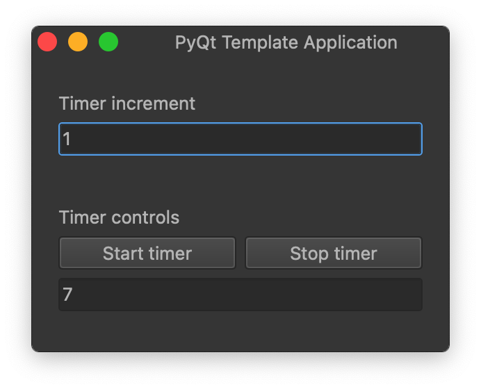

# PyQt Countdown (Template Application)

Basic timer application that demonstrates most of the core functionality of PyQt. To use as a template, simply click the `Use this template` button at the top of the repository page.



## To contribute to the source code

1. Clone this repository:

```bash
git clone git@github.com:lukasvasadi/pyqt-template.git
```

2. Install dependencies:

```bash
pip install -r requirements.txt
```

3. Run the application:

```bash
python main.py
```
